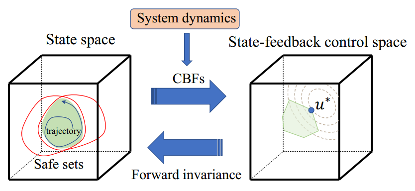

# Adaptive Control Barrier Functions

Lyapunov methods for safety-critical control theory (in Matlab)

 


There is one simple demo using Adaptive CBFs: Adaptive Cruise Control.


If you find this helpful, please cite our work:
```
@article{xiao2021adaptive,
  title={Adaptive control barrier functions},
  author={Xiao, Wei and Belta, Calin and Cassandras, Christos G},
  journal={IEEE Transactions on Automatic Control},
  volume={67},
  number={5},
  pages={2267--2281},
  year={2021},
  publisher={IEEE}
}
```